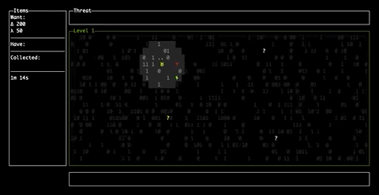

# zen-doctor
In this game, you play the role of a hacker trying to extract data from the bitstream.
Your objective is to gather enough data and escape through the exit portal without getting caught.

Moving in the bitstream, or getting hit by the bad bits, will increase your threat. Standing still, or collecting
the good bits in the bit stream, will reduce your threat. 


Controls:
- `w` / `a` / `s` / `d` or the arrow keys to move
- `space` to pause, resume, or restart if you are caught
- `ctrl-c` to quit




# about
It's built using [gocui](https://github.com/jroimartin/gocui) and requires go1.16 or later. To play it, run:

```shell
go install github.com/krixi/zen-doctor@latest
```

Then you should just be able to run `zen-doctor` to play it. 

If you can't see all the symbols because your font doesn't support them, try running with `--latin`, or `--ascii` for only ASCII characters.


TO-DO list:

1. Power-ups:
   1. timed power up for increasing vision range,
   2. timed power up for reducing threat faster,
   3. immune to negative bits,
   4. timed "combat" power up that reduces threat when running into an enemy instead of increasing it
   5. speed up looting,
   6. slow down bit stream,
2. AI enemies: patrol (with vision cone), follow your tracks, homing on your location (unleashed on 100% threat - game over when they catch you)
3. Items you can use - build pylons, portals, or things. More advanced levels? i.e. once you make it past the firewall, you are inside the mainframe - no longer a constant bit stream, but a maze with enemies and specific objectives.
4. Walls and things that interrupt the bit stream - give shelter
5. Show stats at end of game for collisions with bit stream - how many and what kind of both good and bad bits